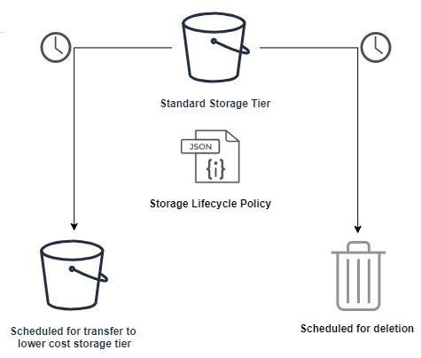

# Cloudmesh Object Life Cycle Management Service

Bill Screen | wscreen@iu.edu | Indiana University | hid: fa19-516-167

## Abstract

As the volume of data being generated and stored by cloud service providers (CSP) continues to grow at a rapid pace, managing the lifecycle of stored data in a thoughtful manner becomes necessary to control costs and accurately forecast spending. 

According to the VisualCapitalist.com, "By 2025, it’s estimated that 463 exabytes of data will be created each day globally – that’s the equivalent of 212,765,957 DVDs per day!" As of 11/2019, it currently costs ~$20,000 USD to store 1 PB of data in the cloud.

Without a data lifecycle management strategy, objects sent to a CSP could be stored indefinitely. Even if the objects (data) are infrequently or never accessed, the customer will likely be charged for storage (beyond a certain 'free storage limit'). This will ultimately lead to 'sloppy storage' and the 'deletion dilemma'. 

By strategically applying a lifecycle storage policy to control costs and accurately forecast spending, organizations can prevent cost overruns and are better positioned to successfully manage their data in the cloud. Storage lifecycle policies will be particularly important for government organizations and public universities who store large amounts of data but typically have limited budgets. 

## Introduction

Integrate Cloudmesh with cloud service providers' object storage lifecycle management services to effectively manage storage costs throughout their lifecycle. This service is intended to be used in conjunction with to the Cloudmesh storage project https://github.com/cloudmesh/cloudmesh-storage

Implementation of lifecycle policies will be provided for AWS and GCP in the initial release. 


## Architecture



This service provides a standard command-line interface that allows you to set the storage lifecycle policy rules for storage buckets in multiple CSPs.


## Technologies
* cloudmesh storage
 
```
Usage:
    storagelifecycle put SERVICE STORAGE_BUCKET_NAME (--expiry_in_days=NUM_DAYS | --lifecycle_config FILE)
    storagelifecycle get SERVICE STORAGE_BUCKET_NAME            
    storagelifecycle delete SERVICE STORAGE_BUCKET_NAME 

Options:
    --expiry_in_days=NUM_DAYS   Days until objects in bucket are removed
    --lifecycle_config FILE     File containing storage lifecycle rules for bucket or objects in bucket

Arguments:
    SERVICE                 Name of the cloud service provider (i.e. aws, gcp, azure)
    STORAGE_BUCKET_NAME     Id of the cloud service provider bucket
    NUM_DAYS                NUMBER OF DAYS

Description:
    Manage cloud service provider objects so that they are stored cost-effectively throughout their lifecycle.
    AWS and GCP are currently supported.

    storagelifecycle put SERVICE STORAGE_BUCKET_NAME (--expiry_in_days=NUM_DAYS | --lifecycle_config FILE)
        Creates a new lifecycle configuration for the bucket or replaces an existing lifecycle configuration.

    storagelifecycle delete SERVICE STORAGE_BUCKET_NAME
        Removes all the lifecycle configuration rules in the lifecycle subresource associated with the (STORAGE_ID).

    storagelifecycle get SERVICE STORAGE_BUCKET_NAME
        Returns the lifecycle configuration information set on the bucket.

Example:
    storagelifecycle put "gcp" "cloudmesh-bucket-001" --expiry_in_days=90
    storagelifecycle put "gcp" "cloudmesh-bucket-001" --lifecycle_config="C:\\mydir\\gcp_lifecycle_config.json"                        
    storagelifecycle get "gcp" "cloudmesh-bucket-001"
    storagelifecycle delete "gcp" "cloudmesh-bucket-001"

    For advanced storage lifecycle configurations, use the  --lifecycle_config FILE option:
    
    Example Google lifecycle config:
    { 
    "lifecycle":{ 
        "rule":[ 
            { 
                "action":{ 
                "type":"SetStorageClass",
                "storageClass":"NEARLINE"
                },
                "condition":{ 
                "age":365,
                "matchesStorageClass":[ 
                    "MULTI_REGIONAL",
                    "STANDARD",
                    "DURABLE_REDUCED_AVAILABILITY"
                ]
                }
            }
        ]
    }
    }

    Example AWS lifecycle config:
    { 
    "Rules":[ 
        { 
            "Filter":{ 
                "Prefix":"documents/"
            },
            "Status":"Enabled",
            "Transitions":[ 
                { 
                "Days":365,
                "StorageClass":"GLACIER"
                }
            ],
            "Expiration":{ 
                "Days":3650
            },
            "ID":"ExampleRule"
        }
    ]
    }


```

Supporting Documentation:
https://docs.aws.amazon.com/AmazonS3/latest/dev/intro-lifecycle-rules.html

https://www.visualcapitalist.com/how-much-data-is-generated-each-day/


## Progress

**Week of 10/06:** After many struggles, finally got Cloudmesh and MongoDB to install on Windows 10 (call 'cms init' twice!). Automated the install process via a batch script. Also added logic to validate connectivity to chameleon Cloud by executing 'image' and 'flavor' list commands. 

**Week of 10/13:** Reviewing the cloudmesh storage source code to understand the Python coding design pattern to follow for this project. Also trying to understand how to use VS Code debugger with CM source code, and how to setup pytests. 

**Week of 10/20:** Implemented initial Provider design for AWS and Google Cloud Platform. Code clean up. Will start on pytest cases next week.


Abstract
Introduction
Design
    Architecture
Implementation
    Technologies Used
Results
    Deployment Benchmarks
    Application Benchmarks
(Limitations)
Conclusion
(Work Breakdown)